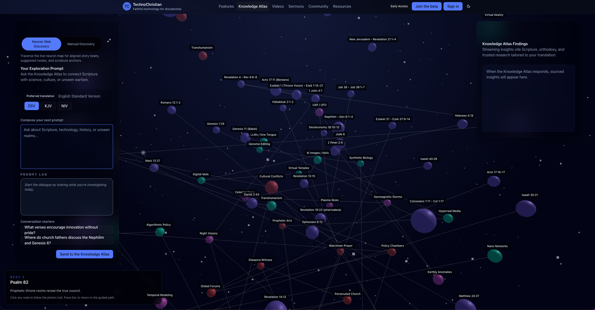

# omi-neuron-web

Agent Implementation Guide (exhaustive)

This README is written for AI agents and engineers who need a complete, precise view of the repo and how to implement or extend it. It enumerates every public entry point, type, class, configuration field, and runtime behavior that the library exposes today.

If you are working inside this repo, also read `AGENTS.md` for execution rules, plan order, and task tracking.

## What this repo provides

- A TypeScript library for graph data analysis plus 3D visualization (Three.js) with a Next.js-friendly API.
- A CLI that scaffolds configuration, Docker Postgres (pgvector), and Next.js route handlers.
- A Node/Edge/Cluster data model, plus analysis and embeddings pipelines.
- A React provider and hooks that wrap the API client.

## Package entry points

The published package exposes these entry points (see `package.json` exports):

- `@omiron33/omi-neuron-web` (root) - types, schemas, analysis, storage, config helpers, visualization component, React hooks/provider.
- `@omiron33/omi-neuron-web/api` - API route factory, repositories, query builder, middleware, API types.
- `@omiron33/omi-neuron-web/visualization` - NeuronWeb component, theme, layout utilities, scene manager.
- `@omiron33/omi-neuron-web/migration` - migration list and runner.
- `@omiron33/omi-neuron-web/cli` - CLI entry (also exposed via the `omi-neuron` binary).

## Repository map (what to edit)

- `src/core/types/*` - Type system. If you add fields, update Zod schemas and migrations.
- `src/core/schemas/*` - Zod runtime validation. Keep in sync with types.
- `src/core/analysis/*` - Embeddings, clustering, relationship inference, scoring, pipeline.
- `src/core/events/*` - Event bus and event types.
- `src/storage/*` - Database, Docker manager, query helpers, migrations.
- `src/api/*` - Route factory, repositories, query builder, middleware.
- `src/visualization/*` - Three.js scene, renderers, interactions, animations, layout.
- `src/react/*` - Provider, context, API client, hooks.
- `src/cli/*` - CLI commands and templates.
- `docs/*` - Additional docs (older, not as exhaustive as this README).

## Root exports (from `src/index.ts`)

```ts
// Types and schemas
export * from './core/types';
export * from './core/schemas';
export * from './core/events';

// Analysis engines
export { DataProcessor } from './core/analysis/data-processor';
export { EmbeddingsService } from './core/analysis/embeddings-service';
export { ClusteringEngine } from './core/analysis/clustering-engine';
export { RelationshipEngine } from './core/analysis/relationship-engine';
export { ScoringEngine } from './core/analysis/scoring-engine';
export { AnalysisPipeline } from './core/analysis/pipeline';

// Storage helpers
export * from './storage';

// Config helper
export * from './config';

// Visualization
export { NeuronWeb } from './visualization';
export type { NeuronWebProps, NeuronWebTheme, NeuronLayoutOptions, NeuronLayoutMode } from './visualization';

// React integration
export * from './react/hooks';
export { NeuronWebProvider } from './react/NeuronWebProvider';

// Version constant
export const VERSION = '0.1.1';
```

Note: `VERSION` is not currently auto-synced to `package.json`. Update it when releasing.

## Configuration: NeuronConfig and NeuronSettings

These types live in `src/core/types/settings.ts` and are validated by Zod schemas in `src/core/schemas/settings.ts`.

### NeuronConfig (full configuration)

```ts
export interface NeuronConfig extends NeuronSettings {
  openai: {
    apiKey: string;
    organization?: string;
    requestsPerMinute?: number;
    maxRetries?: number;
  };
  database: {
    mode: 'docker' | 'external';
    port: number;
    containerName?: string;
    image?: string;
    user?: string;
    password?: string;
    database?: string;
    url?: string;
    pool?: {
      min: number;
      max: number;
      idleTimeoutMs: number;
      connectionTimeoutMs: number;
    };
    resources?: {
      memoryLimit: string;
      cpuLimit?: string;
    };
  };
  api: {
    basePath: string;
    enableCors: boolean;
    rateLimit?: {
      windowMs: number;
      max: number;
    };
  };
  logging: {
    level: 'debug' | 'info' | 'warn' | 'error';
    prettyPrint: boolean;
  };
}
```

### NeuronSettings (runtime settings persisted in DB)

```ts
export interface NeuronSettings {
  instance: {
    name: string;
    version: string;
    repoName: string;
  };
  visualization: VisualizationSettings;
  analysis: AnalysisSettings;
  nodeTypes: NodeTypeConfig[];
  domains: DomainConfig[];
  relationshipTypes: RelationshipTypeConfig[];
}
```

### Default settings (exact defaults)

From `DEFAULT_VISUALIZATION_SETTINGS` and `DEFAULT_ANALYSIS_SETTINGS` in `src/core/types/settings.ts`:

```ts
export const DEFAULT_VISUALIZATION_SETTINGS = {
  domainColors: {},
  defaultDomainColor: '#c0c5ff',
  edgeColor: '#4d4d55',
  edgeActiveColor: '#c6d4ff',
  backgroundColor: '#020314',
  defaultCameraPosition: [4, 8, 20],
  defaultCameraTarget: [0, 0, 0],
  minZoomDistance: 4,
  maxZoomDistance: 42,
  enableStarfield: true,
  starfieldCount: 1200,
  labelDistance: 26,
  maxVisibleLabels: 50,
  performanceMode: 'auto',
  nodeCountThreshold: 120,
  pixelRatioCap: 2,
  enableAnimations: true,
  focusTweenDuration: 800,
  filterTransitionDuration: 650,
  enableHover: true,
  enableClick: true,
  enableDoubleClick: true,
  enablePan: true,
  enableZoom: true,
  enableRotate: true,
};

export const DEFAULT_ANALYSIS_SETTINGS = {
  embeddingModel: 'text-embedding-3-small',
  embeddingDimensions: 1536,
  embeddingBatchSize: 20,
  embeddingCacheTTL: 86400,
  clusteringAlgorithm: 'kmeans',
  defaultClusterCount: 8,
  minClusterSize: 3,
  clusterSimilarityThreshold: 0.75,
  relationshipInferenceModel: 'gpt-4o-mini',
  relationshipMinConfidence: 0.7,
  relationshipMaxPerNode: 10,
  openaiRateLimit: 60,
  maxConcurrentAnalysis: 5,
};
```

### Full config example (neuron.config.ts)

The CLI (`omi-neuron init`) writes a full config file. A complete config looks like:

```ts
import { defineNeuronConfig, DEFAULT_ANALYSIS_SETTINGS, DEFAULT_VISUALIZATION_SETTINGS } from '@omiron33/omi-neuron-web';

export default defineNeuronConfig({
  instance: {
    name: 'my-instance',
    version: '0.1.1',
    repoName: 'my-repo',
  },
  visualization: DEFAULT_VISUALIZATION_SETTINGS,
  analysis: DEFAULT_ANALYSIS_SETTINGS,
  nodeTypes: [],
  domains: [],
  relationshipTypes: [],
  openai: {
    apiKey: process.env.OPENAI_API_KEY ?? '',
    organization: undefined,
    requestsPerMinute: undefined,
    maxRetries: 3,
  },
  database: {
    mode: 'docker',
    port: 5433,
    containerName: undefined,
    image: 'pgvector/pgvector:pg16',
    user: 'neuron',
    password: 'neuron_dev',
    database: 'neuron_web',
    url: undefined,
    pool: {
      min: 0,
      max: 10,
      idleTimeoutMs: 30000,
      connectionTimeoutMs: 5000,
    },
    resources: {
      memoryLimit: '1g',
      cpuLimit: undefined,
    },
  },
  api: {
    basePath: '/api/neuron',
    enableCors: false,
    rateLimit: undefined,
  },
  logging: {
    level: 'info',
    prettyPrint: true,
  },
});
```

### Environment variables

- `OPENAI_API_KEY` - required for embeddings and relationship inference.
- `DATABASE_URL` - optional; if set, the Database factory uses it.
- `DB_HOST`, `DB_PORT`, `DB_USER`, `DB_PASSWORD`, `DB_NAME` - optional per `createDatabaseFromEnv()`.

## Core data model (Types)

### Nodes

`NeuronNode` fields (see `src/core/types/node.ts`):

- identity: `id`, `slug`, `label`, `nodeType`, `domain`, `createdAt`, `updatedAt`
- content: `summary`, `description`, `content`
- metadata: `metadata: Record<string, unknown>`
- analysis fields: `embedding`, `embeddingModel`, `embeddingGeneratedAt`, `clusterId`, `clusterSimilarity`
- relationship counts: `connectionCount`, `inboundCount`, `outboundCount`
- status: `analysisStatus`, `analysisError`
- visualization hints: `tier`, `visualPriority`, `positionOverride`

Input types:

- `NeuronNodeCreate` (minimal required fields: `label`; optional `slug`, `nodeType`, `domain`, `summary`, `description`, `content`, `metadata`, `tier`)
- `NeuronNodeUpdate` (partial updates)
- `NeuronNodeBatchCreate` (batch create with options)

Visualization type:

- `NeuronVisualNode` has `id`, `slug`, `label`, `domain`, `tier`, `metadata`, `ref`, `connectionCount`, `position`.

### Edges

`NeuronEdge` fields (see `src/core/types/edge.ts`):

- identity: `id`, `fromNodeId`, `toNodeId`, `relationshipType`
- strength/confidence: `strength`, `confidence`
- evidence: `EdgeEvidence[]`
- metadata: `label`, `description`, `metadata`, `source`, `sourceModel`, `bidirectional`, timestamps

Input types: `NeuronEdgeCreate`, `NeuronEdgeUpdate`.

Visualization type: `NeuronVisualEdge` uses `from` and `to` slugs.

### Clusters

`NeuronCluster` fields (see `src/core/types/cluster.ts`):

- identity: `id`, `label`, `clusterType`
- centroid: `centroid: number[]`
- stats: `memberCount`, `avgSimilarity`, `cohesion`
- metadata: `description`, `keywords`, `metadata`

### Analysis

`AnalysisRun`, `AnalysisRequest`, `AnalysisResponse`, `AnalysisPipelineConfig` are in `src/core/types/analysis.ts`.

### Events

Event types and payloads are defined in `src/core/types/events.ts`.

## Zod schemas

All runtime validation lives in `src/core/schemas/*`.

Key exports:

- Nodes: `nodeTierSchema`, `nodeCreateSchema`, `nodeUpdateSchema`, `nodeBatchCreateSchema`, `nodeFilterSchema`
- Edges: `edgeEvidenceSchema`, `edgeCreateSchema`, `edgeUpdateSchema`, `edgeFilterSchema`
- Clusters: `clusteringConfigSchema`, `clusterCreateSchema`, `clusterUpdateSchema`
- Analysis: `analysisOptionsSchema`, `analysisRequestSchema`
- Settings: `nodeTypeConfigSchema`, `domainConfigSchema`, `relationshipTypeConfigSchema`, `visualizationSettingsSchema`, `analysisSettingsSchema`, `neuronSettingsSchema`, `neuronSettingsUpdateSchema`, `neuronConfigSchema`
- API: `listNodesParamsSchema`, `listEdgesParamsSchema`, `getGraphParamsSchema`, `expandGraphRequestSchema`, `findPathRequestSchema`, `semanticSearchRequestSchema`, `findSimilarRequestSchema`

## Storage layer

### Database

Class: `Database` in `src/storage/database.ts`.

Constructor:

```ts
new Database({
  connectionString?: string,
  host?: string,
  port?: number,
  user?: string,
  password?: string,
  database?: string,
  pool?: { min; max; idleTimeoutMs; connectionTimeoutMs },
  ssl?: boolean | object,
  slowQueryThresholdMs?: number,
});
```

Methods:

- `connect()` / `disconnect()`
- `isConnected()`
- `query<T>(sql, params)`
- `queryOne<T>(sql, params)`
- `execute(sql, params)`
- `transaction(fn)`
- `tableExists(tableName)`
- `getPoolStats()`

### DockerManager

Class: `DockerManager` in `src/storage/docker-manager.ts`.

Constructor config:

```ts
new DockerManager({
  repoName: string,
  port: number,
  containerName?: string,
  image?: string,
  user?: string,
  password?: string,
  database?: string,
  memoryLimit?: string,
});
```

Methods:

- `start({ forceRecreate?, waitForReady?, timeoutMs? })`
- `stop({ removeVolumes?, timeoutMs? })`
- `ensureRunning({ waitForReady? })`
- `isRunning()`
- `healthCheck()` -> `{ containerRunning, databaseReady, connectionString, details? }`
- `getStats()` -> container stats
- `getConnectionString()`
- `getLogs({ tail?, since? })`
- `execSql(sql)`
- `updatePort(newPort)`

### MigrationRunner

Class: `MigrationRunner` in `src/storage/migrations/runner.ts`.

Methods:

- `getStatus()` -> applied/pending
- `getPending()`
- `getApplied()`
- `up({ to? })`
- `down({ to?, count? })`
- `reset()`
- `dryRun('up' | 'down')`

### Database schema (migrations)

Defined in `src/storage/migrations/*.ts`:

- `nodes` table: `slug`, `label`, `node_type`, `domain`, `summary`, `description`, `content`, `metadata`, `tier`, `visual_priority`, `position_override`, `connection_count`, `inbound_count`, `outbound_count`, `analysis_status`, `analysis_error`, timestamps.
- `edges` table: `from_node_id`, `to_node_id`, `relationship_type`, `strength`, `confidence`, `evidence`, `label`, `description`, `metadata`, `source`, `source_model`, `bidirectional`, timestamps.
- `settings` table: JSONB settings for `visualization`, `analysis`, `node_types`, `domains`, `relationship_types`.
- `clusters` table and `cluster_memberships` table.
- `analysis_runs` table for pipeline jobs.
- Extensions: `uuid-ossp`, `vector` (pgvector).

## Analysis engines

### DataProcessor

File: `src/core/analysis/data-processor.ts`

- Converts arbitrary input records to `NeuronNodeCreate`.
- Options: `skipDuplicates`, `updateOnConflict`, `defaultNodeType`, `defaultDomain`, `contentFields`, `labelField`, `slugField`, `metadataFields`.
- Key methods: `processItem`, `processBatch`, `processJSON`, `processCSV`, `generateSlug`, `extractContent`, `detectDuplicates`.

### EmbeddingsService

File: `src/core/analysis/embeddings-service.ts`

Constructor:

```ts
new EmbeddingsService({
  openaiApiKey: string,
  model: 'text-embedding-ada-002' | 'text-embedding-3-small' | 'text-embedding-3-large',
  dimensions?: number,
  batchSize: number,
  rateLimit: number,
  cacheTTL: number,
  maxRetries: number,
}, db)
```

Methods:

- `generateEmbedding(text)`
- `generateBatchEmbeddings(texts)`
- `embedNode(nodeId)`
- `embedNodes(nodeIds)`
- `getCachedEmbedding(nodeId)`
- `cacheEmbedding(nodeId, embedding, model)`
- `invalidateCache(nodeIds?)`
- `countTokens(text)`
- `estimateCost(nodeCount)`

### ClusteringEngine

File: `src/core/analysis/clustering-engine.ts`

Methods:

- `clusterNodes(config)` -> `{ clusters, unassigned }`
- `recluster(config)`
- `assignToCluster(nodeId)`
- `findBestCluster(embedding)`
- `recomputeCentroid(clusterId)` / `recomputeAllCentroids()`
- `generateClusterLabel(clusterId)` / `generateAllLabels()`
- `calculateSilhouetteScore(clusters)`
- `calculateCohesion(cluster)`

### RelationshipEngine

File: `src/core/analysis/relationship-engine.ts`

Constructor config:

```ts
{
  model: string;
  minConfidence: number;
  maxPerNode: number;
  similarityThreshold: number;
  includeExisting: boolean;
  batchSize: number;
  rateLimit: number;
}
```

Methods:

- `inferForNode(nodeId)`
- `inferForNodes(nodeIds)`
- `inferAll()`
- `findCandidates(nodeId)`
- `validateRelationship(rel)`
- `createEdgesFromInferences(inferences, autoApprove?)`

### ScoringEngine

File: `src/core/analysis/scoring-engine.ts`

- Constructor accepts optional config `{ similarityWeight, connectionWeight, recencyWeight, domainBoost }`.
- Key methods: `cosineSimilarity`, `semanticSimilarity`, `scoreForQuery`, `findSimilar`, `calculateNodeImportance`, `rankAllNodes`, `scoreRelevance`.

### AnalysisPipeline

File: `src/core/analysis/pipeline.ts`

Constructor: `(db, embeddings, clustering, relationships, events)`.

Methods:

- `runFull(options)`
- `runEmbeddings(options)`
- `runClustering(options)`
- `runRelationships(options)`
- `getJob(jobId)` / `listJobs({ status?, limit? })`
- `cancelJob(jobId)` / `isRunning()`

`PipelineOptions` fields include `nodeIds`, `forceRecompute`, `skipEmbeddings`, `embeddingModel`, `skipClustering`, `clusterCount`, `clusteringAlgorithm`, `skipRelationships`, `relationshipThreshold`, `maxRelationshipsPerNode`, `onProgress`, `webhookUrl`.

## API layer

### createNeuronRoutes

Entry point: `createNeuronRoutes(config)` from `@omiron33/omi-neuron-web/api`.

Returns:

```ts
{
  nodes: createNodesRoutes(config),
  edges: createEdgesRoutes(config),
  graph: createGraphRoutes(config),
  analyze: createAnalyzeRoutes(config),
  settings: createSettingsRoutes(config),
  search: createSearchRoutes(config),
  health: createHealthRoutes(config),
}
```

### Route behaviors

All handlers accept a Fetch API `Request` and return `Response` (Next.js route handlers are compatible).

Nodes:

- `GET /nodes` -> list nodes with pagination. Uses `listNodesParamsSchema`.
- `POST /nodes` -> batch create. Uses `nodeBatchCreateSchema`.
- `PATCH /nodes/:id` -> update. Uses `nodeUpdateSchema`.
- `DELETE /nodes/:id` -> delete.

Edges:

- `GET /edges` -> list edges. Uses `listEdgesParamsSchema`.
- `POST /edges` -> batch create. Uses `edgeCreateSchema`.
- `PATCH /edges/:id` -> update.
- `DELETE /edges/:id` -> delete.

Graph:

- `GET /graph` -> returns `NeuronVisualNode` and `NeuronVisualEdge` arrays.
- `POST /graph/expand` -> expansion by depth.
- `POST /graph/path` -> find paths.

Analyze:

- `POST /analyze` -> runs analysis pipeline (embeddings, clustering, relationships, or full).
- `GET /analyze/:jobId` -> fetch job status.
- `POST /analyze/:jobId/cancel` -> cancel job.
- `GET /analyze/history` -> list recent jobs.

Settings:

- `GET /settings` -> fetch settings from DB.
- `PATCH /settings` -> update settings.
- `POST /settings/reset` -> reset entire or specific sections.

Search:

- `POST /search` -> semantic search.
- `POST /search/similar` -> find similar to node.

Health:

- `GET /health` -> basic DB connectivity.

### API client

`NeuronApiClient` in `src/react/api-client.ts` wraps these endpoints; see that file for exact method names and payloads.

### Middleware

From `src/api/middleware/*` (exported in `@omiron33/omi-neuron-web/api`):

- `withNeuronMiddleware(handler, { cors? })`
- `withErrorHandler(handler)` and `handleError(error)`
- `withLogging(handler)`
- `withTiming(handler)`
- `withCors({ origins? })`
- `withValidation(schema, source)`

## React integration

### NeuronWebProvider

Wrap your app and provide configuration. The provider loads settings from `/api/neuron/settings` via the API client.

```tsx
import { NeuronWebProvider } from '@omiron33/omi-neuron-web';

export default function RootLayout({ children }) {
  return (
    <NeuronWebProvider
      config={{
        openaiApiKey: process.env.NEXT_PUBLIC_OPENAI_API_KEY,
        databaseUrl: process.env.NEXT_PUBLIC_DATABASE_URL,
        settings: {},
        onEvent: (event) => {},
        onError: (error) => {},
      }}
    >
      {children}
    </NeuronWebProvider>
  );
}
```

### Hooks

- `useNeuronContext()` -> access provider context.
- `useNeuronGraph({ domains?, nodeTypes?, minEdgeStrength?, autoRefresh?, refreshInterval? })` -> fetch and explore graph.
- `useNeuronNodes({ initialFilters?, pageSize? })` -> CRUD nodes and pagination.
- `useNeuronAnalysis()` -> start/cancel/check analysis jobs.
- `useNeuronSettings()` -> update or reset settings.
- `useNeuronSearch()` -> semantic search and find similar nodes.
- `useNeuronEvents()` -> subscribe/emit events.

Also available:

- `useNodeEvents(handlers)`
- `useAnalysisEvents(handlers)`

## Visualization (NeuronWeb)

### Component props (full list)

`NeuronWebProps` from `src/visualization/types.ts`:

```ts
export interface NeuronWebProps {
  graphData: {
    nodes: NeuronVisualNode[];
    edges: NeuronVisualEdge[];
    storyBeats?: NeuronStoryBeat[];
  };
  fullHeight?: boolean;
  isFullScreen?: boolean;
  className?: string;
  style?: React.CSSProperties;
  isLoading?: boolean;
  error?: string | null;
  selectedNode?: NeuronNode | null;
  focusNodeSlug?: string | null;
  onFocusConsumed?: () => void;
  visibleNodeSlugs?: string[] | null;
  onNodeClick?: (node: NeuronNode) => void;
  onNodeDoubleClick?: (node: NeuronNode) => void;
  onNodeHover?: (node: NeuronNode | null) => void;
  onNodeFocused?: (node: NeuronNode) => void;
  onEdgeClick?: (edge: NeuronEdge) => void;
  onBackgroundClick?: () => void;
  onCameraChange?: (position: [number, number, number]) => void;
  studyPathRequest?: StudyPathRequest | null;
  onStudyPathComplete?: () => void;
  layout?: NeuronLayoutOptions;
  cameraFit?: CameraFitOptions;
  cardsMode?: CardsMode;
  clickCard?: ClickCardOptions;
  clickZoom?: ClickZoomOptions;
  theme?: NeuronWebThemeOverride;
  domainColors?: Record<string, string>;
  renderNodeHover?: (node: NeuronVisualNode) => React.ReactNode;
  hoverCard?: HoverCardOptions;
  renderNodeDetail?: (node: NeuronNode) => React.ReactNode;
  renderEmptyState?: () => React.ReactNode;
  renderLoadingState?: () => React.ReactNode;
  performanceMode?: 'auto' | 'normal' | 'degraded' | 'fallback';
  ariaLabel?: string;
}
```

Props currently used inside `NeuronWeb` (others are reserved for future use):

- Used: `graphData`, `className`, `style`, `fullHeight`, `isFullScreen`, `isLoading`, `error`, `renderEmptyState`, `renderLoadingState`, `ariaLabel`, `theme`, `layout`, `renderNodeHover`, `renderNodeDetail`, `hoverCard`, `clickCard`, `clickZoom`, `cardsMode`, `onNodeHover`, `onNodeClick`, `onNodeDoubleClick`, `onNodeFocused`, `onBackgroundClick`, `performanceMode`, `focusNodeSlug`, `onFocusConsumed`, `visibleNodeSlugs`.
- Used: `cameraFit` (auto-fit bounds to a viewport fraction).
- Reserved (declared but not used in the component yet): `selectedNode`, `onEdgeClick`, `onCameraChange`, `studyPathRequest`, `onStudyPathComplete`, `domainColors`, `graphData.storyBeats`.

### Layout modes

`NeuronLayoutMode` = `'auto' | 'positioned' | 'fuzzy' | 'atlas'`.

`applyFuzzyLayout()` behavior:

- `positioned`: return nodes as-is (use positions from DB or API).
- `auto`: if any node lacks a `position`, run `atlas` layout; otherwise return nodes as-is.
- `atlas`: sphere layout with built-in override map (`ATLAS_POSITION_OVERRIDES` in `src/visualization/layouts/fuzzy-layout.ts`).
- `fuzzy`: deterministic pseudo-random scatter based on `seed` and node key.

Layout options:

```ts
{
  mode?: NeuronLayoutMode;
  radius?: number;       // base radius for layout
  insightRadius?: number; // smaller radius for insight nodes
  jitter?: number;       // random jitter
  zSpread?: number;      // z-axis spread
  seed?: string;         // deterministic seed
  spread?: number;       // global scale factor
  overrides?: Record<string, [number, number, number]>; // slug/id -> position
}
```

### Camera auto-fit (center-third framing)

Use `cameraFit` to center and zoom so all nodes sit inside a specific viewport fraction (default: 0.33 = center third).
When `isFullScreen` is true and `cameraFit.enabled` is not specified, auto-fit is enabled by default.
Auto-fit pauses whenever a node is selected/focused (click or programmatic focus) so the camera
doesn't snap back to the full graph. Clear selection (background click) to allow future fits.

```tsx
<NeuronWeb
  graphData={graphData}
  isFullScreen
  cameraFit={{
    enabled: true,
    mode: 'once',          // or 'onChange' to refit when node positions change
    viewportFraction: 0.33, // center-third framing
    padding: 0.15,          // 15% padding around bounds
  }}
/>
```

### Technochristian (www.technochristianity.com)-style settings (agent example)

Use this preset to match the Technochristian (www.technochristianity.com) look/behavior in a consuming app
without introducing any new props. This combines fullscreen, center-third framing,
stable atlas layout, click-to-zoom, and restrained visuals:



```tsx
<NeuronWeb
  graphData={graphData}
  isFullScreen
  cameraFit={{
    enabled: true,
    mode: 'once',
    viewportFraction: 0.33,
    padding: 0.15,
  }}
  layout={{
    mode: 'atlas',
    spread: 1.15,
    jitter: 0.15,
    zSpread: 1.1,
  }}
  clickZoom={{ enabled: true }}
  clickCard={{ enabled: true, width: 320, offset: [24, 24] }}
  hoverCard={{ enabled: false }}
  cardsMode="click"
  theme={{
    colors: {
      background: '#0b0f1f',
      edgeDefault: 'rgba(130, 150, 190, 0.4)',
      edgeActive: 'rgba(160, 190, 255, 0.7)',
      labelText: 'rgba(230, 235, 245, 0.92)',
      labelBackground: 'rgba(20, 24, 40, 0.8)',
    },
    effects: {
      starfieldEnabled: true,
      glowEnabled: true,
      glowIntensity: 0.55,
      ambientMotionEnabled: true,
      ambientMotionSpeed: 0.25,
      ambientMotionAmplitude: 0.3,
      edgeFlowEnabled: true,
      edgeFlowSpeed: 0.6,
      fogEnabled: true,
      fogColor: '#0b0f1f',
      fogNear: 20,
      fogFar: 80,
    },
    animation: {
      focusDuration: 900,
      transitionDuration: 600,
      hoverScale: 1.05,
      selectedScale: 1.08,
      selectionPulseScale: 1.12,
      selectionPulseDuration: 1200,
    },
  }}
/>
```

### Programmatic focus (focusNodeSlug)

Use `focusNodeSlug` to drive selection + camera focus from outside the component
(mirrors Technochristian (www.technochristianity.com)’s “focus a node when something else happens” behavior).

Behavior:
- Looks up by **slug**, with **id fallback**.
- Sets selection, pulses the node, and emphasizes connected edges.
- If `clickZoom.enabled` is true (default), the camera tween runs.
- Fires `onNodeFocused(node)` after the focus tween.
- Calls `onFocusConsumed()` so the parent can clear the request.

```tsx
<NeuronWeb
  graphData={graphData}
  focusNodeSlug={focusSlug}
  onFocusConsumed={() => setFocusSlug(null)}
  onNodeFocused={(node) => console.log('focused', node.slug)}
  clickZoom={{ enabled: true }}
/>
```

### Filtered views (visibleNodeSlugs)

`visibleNodeSlugs` limits the graph to a subset of nodes (and their edges).
This is the mechanism Technochristian (www.technochristianity.com) uses for filtered views and decluttering.

Semantics:
- `null` or `undefined` → show **all** nodes/edges.
- `[]` (empty array) → show **none**.
- Filters nodes by **slug or id**; edges are kept only if **both endpoints** are visible.
- `storyBeats` (if present) are filtered to beats with ≥ 2 visible nodeIds.
- A subtle fade/scale/blur transition is applied on each filter change.
- If the currently selected node disappears, selection is cleared.

```tsx
// Show only a curated slice
<NeuronWeb
  graphData={graphData}
  visibleNodeSlugs={['uap', 'neph', 'jude6']}
/>;

// Show everything (default)
<NeuronWeb graphData={graphData} visibleNodeSlugs={null} />;

// Hide everything
<NeuronWeb graphData={graphData} visibleNodeSlugs={[]} />;
```

### Click cards + click zoom

Enable a persistent card on click and optional zoom-to-node behavior:

```tsx
<NeuronWeb
  graphData={graphData}
  clickCard={{ enabled: true, width: 320, offset: [24, 24] }}
  clickZoom={{ enabled: true }}
/>
```

### Card mode (global override)

`cardsMode` lets you force card behavior irrespective of `hoverCard.enabled` or `clickCard.enabled`
(when `cardsMode` is set, it wins).

```tsx
<NeuronWeb graphData={graphData} cardsMode="none" />
<NeuronWeb graphData={graphData} cardsMode="hover" />
<NeuronWeb graphData={graphData} cardsMode="click" />
<NeuronWeb graphData={graphData} cardsMode="both" />
```

Disable click cards or zoom:

```tsx
<NeuronWeb graphData={graphData} clickCard={{ enabled: false }} clickZoom={{ enabled: false }} />
```

To disable in fullscreen:

```tsx
<NeuronWeb graphData={graphData} isFullScreen cameraFit={{ enabled: false }} />
```

### Theme

`NeuronWebTheme` defines colors, typography, effects, and animation. Defaults are in `src/visualization/constants.ts`.

Key behavior in `NeuronWeb`:

- Performance mode is auto-detected unless explicitly set.
- Hover cards are disabled in `fallback` mode.
- Labels and starfield density are reduced in `degraded`/`fallback`.

### Fullscreen vs element rendering

- `isFullScreen: true` makes the component `position: fixed` with `width: 100vw` and `height: 100vh`.
- Default (not full screen) uses `width: 100%` and `height: 100%`. The parent element must define a height.
- `fullHeight: true` sets `min-height: 100vh` when not full screen.

## Visualization internals (agent map)

Key internal modules:

- `src/visualization/scene/scene-manager.ts` - sets up Three.js scene, camera, renderer, lights, starfield, labels.
- `src/visualization/scene/node-renderer.ts` - renders nodes, labels, hover/selection states.
- `src/visualization/scene/edge-renderer.ts` - renders edges, flow animations.
- `src/visualization/interactions/interaction-manager.ts` - hover/click/double-click handling.
- `src/visualization/animations/animation-controller.ts` - camera focus/transition animations.
- `src/visualization/layouts/fuzzy-layout.ts` - layout generation.

## Events

Event system in `src/core/events/event-bus.ts` with types in `src/core/types/events.ts`.

- Subscribe with `EventBus.subscribe(type, handler)` or `subscribeAll(handler)`.
- Emit with `EventBus.emit(createEvent(type, payload, source))`.
- `useNeuronEvents()` provides React helpers to subscribe/emit inside components.

## API types (request/response)

All API request/response types are defined in `src/core/types/api.ts`. If you need to implement a server or client manually, this file is the contract.

## CLI reference (omi-neuron)

The CLI is defined in `src/cli/index.ts` and subcommands in `src/cli/commands/*`.

Commands:

- `omi-neuron init` - scaffold config, docker compose, env file, and Next.js route.
  - `--name`, `--port`, `--skip-docker`, `--skip-api`, `--skip-config`, `--app-dir`, `--force`
- `omi-neuron db up|down|migrate|status|reset|seed`
  - `up`: `--port`, `--force-recreate`, `--wait`
  - `down`: `--remove-volumes`
  - `migrate`: `--status`, `--rollback <n>`, `--to <version>`, `--dry-run`
  - `status`: `--json`, `--verbose`
  - `reset`: `--confirm`
  - `seed`: `--file`, `--clear`, `--count`
- `omi-neuron analyze embeddings|cluster|relationships|full`
  - `embeddings`: `--node-ids`, `--force`
  - `cluster`: `--count`, `--algorithm`
  - `relationships`: `--threshold`, `--dry-run`
  - `full`: `--force`
- `omi-neuron validate` - checks config, docker, DB, and OpenAI env.
- `omi-neuron config get|set|list|reset` - manage `neuron.config.ts` values.

## Known gaps and reserved fields

- Several `NeuronWebProps` are defined but not yet used internally (see list above).
- `VisualizationSettings` vs `NeuronWebTheme`: the component uses theme overrides, not settings. If you want settings to drive visuals, wire them in `NeuronWeb`.
- `VERSION` constant is not auto-updated.

## Build and test

```bash
pnpm install
pnpm build
pnpm typecheck
pnpm lint
pnpm test
```

## Release via tags (automation)

This repo publishes on **tag push**. The tag version is authoritative and must be a **patch bump**.

Workflow:
- Create and push `vX.Y.Z` (same major/minor as `package.json`, patch +1).
- GitHub Actions updates `package.json` + `src/index.ts`, commits to `main`, builds, and publishes.

Helper skill (repo-local):

```bash
skills/tagged-npm-release/scripts/create_patch_tag.sh
```

Authentication:
- **Preferred**: npm **Trusted Publishing** (OIDC). Configure the GitHub repo/workflow in npm package settings. No secret required.
- **Legacy fallback**: set `NPM_TOKEN` in GitHub repo secrets and remove `--provenance` from the workflow.

## License

MIT
